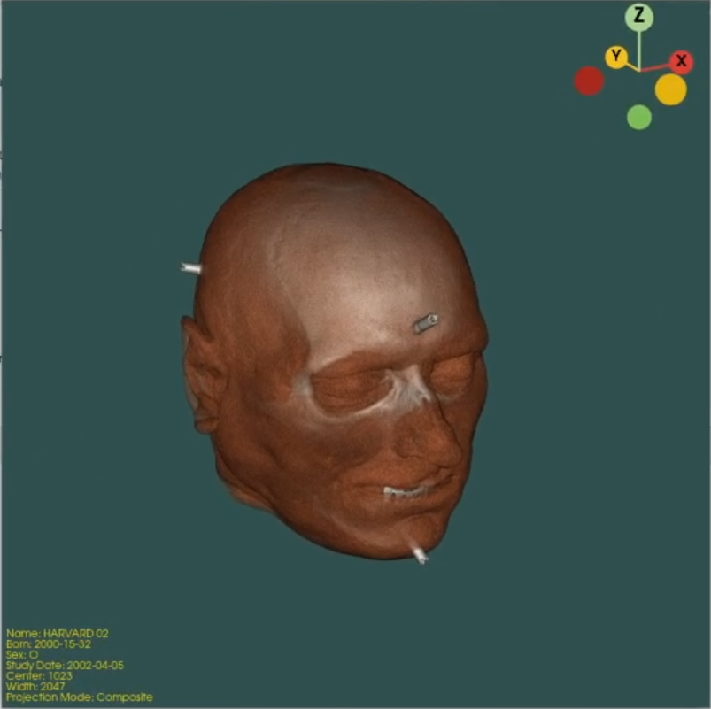

# DumbICOM

This program can load CT data in DICOM format (e.g., from the [Visible-Human Project](https://www.nlm.nih.gov/research/visible/visible_human.html)), and render a 3D visualization from it.

If you really need a DICOM viewer use [AlizaMS](https://github.com/alizamedicalimaging/alizams) instead, because this is just a dumb student project and will not be maintained in any way.

## Build

The project can be built with CMake.

I tried to use `vcpkg` and `conan`, but that way lay madness, so I stopped.
C++ dependency management is a bigger dumpster fire than Python 🤡

Install `boost-devel`, `dcmtk-devel`, `opencv-devel`, `jsoncpp-devel`, and `vtk-devel`.
If on a Debian based distro, replace `devel` with `dev` and hope for the best.

In the project folder:

    cmake -DCMAKE_BUILD_TYPE=Release -S . -B build/
    cmake --build build/

The `dumbicom` executable file will then be located in the `build/` folder.

The following libraries were used:

- [Boost](https://www.boost.org/) v1.78.0
- [OpenGL](https://opengl.org/) v4.6
- [DICOM Toolkit](https://dcmtk.org/) v3.6.7
- [OpenCV](https://opencv.org/) v4.6.0
- [Visualization Toolkit](https://vtk.org/) v9.1.0

The version numbers refer to the ones I used initially.
Other versions may also work fine.

## Usage

Usage and possible parameters can be displayed with the --help flag.

    Usage: ./dumbicom [options] <input>
    
    Program options:
        -h [ --help ]          print help message and exit
        -t [ --threshold ] arg threshold for binarization of cleaning mask (default
                               is 250)
        -b [ --brush ] arg     size of brush for cleaning with morphological
                               operations (default is 25)
        -l [ --lower ] arg     comma separated pair of integer numbers "<row,col>", 
                               for defining region of interest
        -u [ --upper ] arg     comma separated pair of integer numbers "<row,col>", 
                               for defining region of interest

The positional `<input>` argument must be a folder containing DICOM files.
Slices need to be in the correct alphabetical order.

The other arguments are optional.

### Data Preparation

If the relevant parameters are provided, data preparation may take place.
This preparation proceeds as follows:

1. A mask is generated from a copy of the input data.
2. The mask is binarized with `--threshold`.
3. All values outside a region of interest defined by `--lower` and `--upper` are zeroed out.
4. Each layer of the mask is first opened with a disk of radius `--brush`, then closed and dilated with 2x `--brush`.
5. The input data is then bitwise ANDed together with the mask.

For the example data in `female_head`, the parameters `--lower 70,120 --upper 452,380` work particularly well.

### Interactive Control

The animation is interactive and can be controlled.

- The camera can be controlled via drag-and-drop or with the camera orientation widget in the upper-right corner.
- Transparency can be adjusted using the arrow keys:
  - <kbd>Up</kbd>/<kbd>Down</kbd> adjust the width of the trasparency window.
  - <kbd>Left</kbd>/<kbd>Right</kbd> adjust the center of the trasparency window.
- The <kbd>P</kbd> key adjusts the **p**rojection mode.
  The following options are available:
  - "Composite" mode
  - "Maximum Intensity" mode
  - "Iso Surface" mode
  - "Additive" mode
- The camera perspective can be **r**eset with <kbd>R</kbd>.
- Pressing <kbd>Q</kbd> (**q**uit) or closing the window will terminate the program.

### Legend

The legend in the lower-left corner displays the following information:

- Patient's name
- Date of birth
- Gender
- Date of acquisition
- Center of the transparency window
- Width of the transparency window
- Current projection mode

## Example Data

Example data in DICOM format is provided in the [`data`](data) directory.
These were used to test the functionality.

The data in `male_head` comes from the [National Library of Medicine](https://www.nlm.nih.gov/databases/download/vhp.html) and are part of the aforementioned Visible-Human-Project.
The data in `female_head` also comes from the VHP and the NLM®, but was made available by the [University of Iowa](https://medicine.uiowa.edu/mri/facility-resources/images/visible-human-project-ct-datasets).

This project, which mapped the human body in unprecedented detail and provided access to high-quality image data for students like me, was made possible only through body donations.
Thank you "Adam" and "Eve".

## License

My code (everything in the `src` folder) is available under the MIT license.
See [LICENSE](LICENSE) for the exact license terms.

All other contents are unaffected by this and subject to their respective license terms.

The sample data is made available [under these terms](https://www.nlm.nih.gov/databases/download/terms_and_conditions.html), and provided courtesy of the NLM® and UI Carver College of Medicine.
This project is neither affiliated with, nor endorsed by any of these parties
